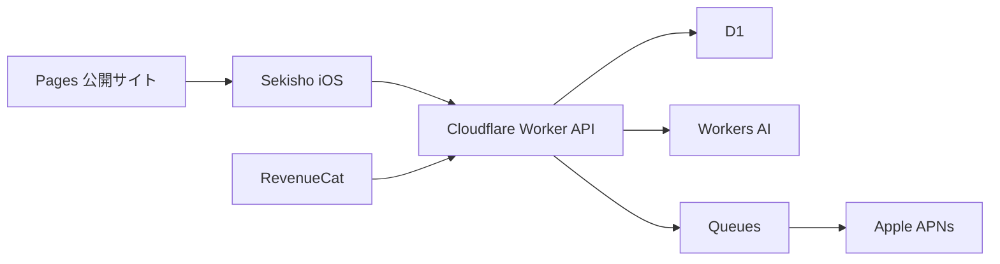

# Sekisho Cloudflare 実装計画

> 更新日: 2026-08-17  
> ステータス: 計画段階（未実装）  
> 本書は `PLAN.md` のバックエンド構成を、Cloudflare中心の構成へ更新するための実装計画である。

## 1. 方針

Sekishoは、個人利用だけで制限アプリとして成立させたうえで、無料の匿名週間リーグによって継続しやすくし、AIコーチをProの主要価値にする。

バックエンドはFirebaseを使用せず、Apple、RevenueCat、APNs以外のサーバー機能を可能な限りCloudflareへ集約する。

### 無料機能

- Screen Timeによる対象アプリの制限
- 合計の1日上限
- 3Dキャラクター、ウィジェット、削除防止
- 8〜20人を目安に毎週自動編成する匿名リーグ
- システムが生成する達成状況の共有

### Pro機能

- アプリ別の制限時間
- 曜日別ルール
- 厳格モード
- AIによる利用傾向分析
- 翌日の制限設定案
- 詳細レポート

Pro価格は月額790円、年額3,990円、7日間無料トライアルとし、年額を初期選択にする。AIの継続原価があるため、生涯Proは初期提供しない。

匿名週間リーグは無料とし、AIと詳細設定をProの課金価値にする。リーグで他の番人や衣装が自然に見えることを、キャラクター課金の発見導線にもする。ただし、課金によってリーグ得点が有利になる要素は作らない。

ユーザー同士の個別メッセージ、グループチャット、自由入力コメントは実装しない。ユーザー同士が送信し合うのではなく、Sekishoが各メンバーの達成状況をリーグへ共有する設計とする。応援スタンプはMVP後の候補とし、追加する場合も返信や会話へ発展しないリーグ全体への定型リアクションに限定する。

### キャラクター育成とコスメ課金

- 約束を守った日数や継続によって番人が育つ。
- 基本の育成進行は無料ユーザーも利用できる。
- 追加キャラクター、衣装、部屋の装飾、アイテムパックを非消耗型IAPとして販売する。
- 購入済みコスメはPro解約後も保持する。
- Proには加入中だけ利用できるコスメコレクションを追加できる。
- 衣装は300〜500円、追加キャラクターは800〜1,200円、装飾・アイテムパックは300〜800円を初期仮説とする。
- ランダムなガチャ、制限解除アイテム、課金しないと育成できない設計は採用しない。

## 2. システム構成

| 用途 | 採用サービス |
|---|---|
| iOS向けAPI | Cloudflare Workers |
| ユーザー、匿名リーグ、履歴 | Cloudflare D1 |
| Sign in with Apple | WorkerでAppleのトークンを検証 |
| AIコーチ | Workers AI |
| 非同期通知処理 | Cloudflare Queues |
| 定期処理 | Cron Triggers |
| 製品サイト、利用規約、プライバシーポリシー | Cloudflare Pages |
| APIキー、秘密鍵 | Workers Secrets |
| アプリ内課金 | RevenueCatを継続 |
| プッシュ通知 | Apple Push Notification service（APNs） |



FamilyControlsのトークン、対象アプリ名、個別の利用履歴はサーバーへ送信しない。匿名リーグに共有する情報も、達成・未達、継続日数、週間得点のみに限定する。正確な利用時間はリーグへ共有しない。

## 3. 認証設計

CloudflareにはFirebase Auth相当のコンシューマー向け認証機能がないため、Sign in with AppleをWorkerで直接処理する。

1. iOSアプリでnonceを生成し、Sign in with Appleを実行する。
2. identity token、authorization code、nonceをWorkerへ送信する。
3. WorkerがAppleの公開鍵を使用して署名とclaimを検証する。
4. issuer、audience、有効期限、nonceが正しいことを確認する。
5. D1にユーザーを作成または取得する。
6. Sekisho用の短期アクセストークンと更新トークンを発行する。
7. iOS側は認証情報をKeychainへ保存する。

ソロ利用ではアカウント登録を求めず、「匿名リーグに参加する」を選んだ時だけSign in with Appleを表示する。Appleの氏名やメールアドレスはリーグの他ユーザーへ公開しない。

アカウント削除時は、D1上のユーザーデータ、セッション、通知トークンを削除し、Appleのトークン失効処理も行う。

## 4. D1データモデル

### users

- `id`
- `apple_subject`
- `anonymous_handle`
- `mascot_id`
- `timezone`
- `goal_tier`
- `created_at`
- `deleted_at`

`anonymous_handle`はサーバーが用意した安全な語彙から自動生成する。MVPでは自由入力の表示名、プロフィール文、プロフィール画像を持たせない。

### auth_sessions

- `id`
- `user_id`
- `refresh_token_hash`
- `expires_at`
- `revoked_at`

### leagues

- `id`
- `week_start_date`
- `week_end_date`
- `timezone_group`
- `goal_tier`
- `max_members`
- `status`
- `created_at`

MVPでは、1ユーザーが参加できるリーグを週に1つとする。最初は参加者全員を1リーグへ入れ、21人以上になった段階で12〜20人程度に分割する。十分な流動性ができた後で、タイムゾーンと目標強度が近いユーザー同士を編成する。

### league_members

- `league_id`
- `user_id`
- `joined_at`
- `weekly_score`
- `active_days`
- `excluded_at`

### daily_results

- `id`
- `league_id`
- `user_id`
- `local_date`
- `status`
- `score`
- `posted_at`

`status`は、達成、未達、未記録のような限定された値だけを許可する。得点はサーバー側で算出し、クライアントから任意の数値を受け付けない。個別アプリ名、正確な利用時間、FamilyControlsのトークンは保存しない。

初期得点ルールは、1日の約束達成を10点、3日連続達成を追加5点、7日間すべて達成を追加20点とする。未達成による減点は行わない。得点ルールは実測後に調整する。

### device_tokens

- `id`
- `user_id`
- `apns_device_token`
- `environment`
- `updated_at`

### ai_insights

- `id`
- `user_id`
- `target_date`
- `input_version`
- `model_id`
- `summary`
- `suggestion_json`
- `created_at`

### subscription_states

- `user_id`
- `entitlement_id`
- `is_active`
- `expires_at`
- `updated_at`

## 5. API案

```text
POST   /v1/auth/apple
POST   /v1/auth/refresh
POST   /v1/auth/logout
DELETE /v1/account

GET    /v1/leagues/current
POST   /v1/leagues/join
POST   /v1/leagues/leave
GET    /v1/leagues/:id/standings
PUT    /v1/leagues/:id/results/:date

PUT    /v1/devices/apns-token

POST   /v1/ai/insights
GET    /v1/ai/insights/:date

POST   /v1/webhooks/revenuecat
```

APIはバージョンを明示し、Swift側ではプロトコルで抽象化してモック実装と本番実装を切り替えられるようにする。

## 6. 実装フェーズ

### Phase 0: 制限機能の安定化

目安: 2日

- 対象アプリだけが利用時間集計に含まれることを再検証する。
- 無料の合計上限とProのアプリ別上限を回帰テストする。
- 日付変更、端末再起動、権限変更時の状態を検証する。
- 制限中のShield、キャラクター、ホーム表示の同期を検証する。
- 削除防止機能をTestFlightで確認する。
- 開発モードの状態が本番利用へ漏れないよう整理する。

完了条件は、ソロ利用で制限・解除・翌日リセットが安定して動作することとする。

### Phase 1: Cloudflare基盤

目安: 3日

- TypeScriptによるWorker APIを作成する。
- developmentとproduction環境を分ける。
- D1とマイグレーションを作成する。
- D1は主な書き込み元を考慮してAPACのlocation hintで作成する。
- Sign in with Appleと独自セッション管理を実装する。
- アカウント削除とログアウトを実装する。
- Workers Secretsへ鍵を登録する。
- ユーザー単位のレート制限を追加する。
- iOS側にAPIクライアントとKeychain管理を追加する。
- WorkerとD1の自動テストを追加する。

### Phase 2: 匿名週間リーグMVP

目安: 4〜5日

- Sign in with Apple後に匿名リーグへ参加できるようにする。
- 安全な語彙から匿名ハンドルを自動生成する。
- 番人と衣装をリーグ上のアバターとして表示する。
- Cron Triggersで毎週リーグを自動編成する。
- 参加者が20人以下の間は全員を1リーグへ入れる。
- 21人以上では12〜20人程度のリーグへ分割する。
- 流動性が増えた後は、タイムゾーンと目標強度を編成条件へ追加する。
- 今日の達成・未達を共有する。
- 得点と週間順位をサーバー側で算出する。
- 未達成を減点せず、他人の正確な利用時間を表示しない。
- 1週間活動しなかったユーザーを次週の編成対象から外す。
- リーグ参加の解除を実装する。
- 通信できない場合のオフライン表示を実装する。

ホームと設定の2タブは維持し、ホーム上の「今週の宿場」カードから匿名リーグ画面へ遷移する。

初期実装には、個別メッセージ、グループチャット、自由入力コメント、自由入力プロフィール、応援スタンプ、罰金、友達招待、詳細な利用履歴共有を含めない。個別メッセージとグループチャットは将来も追加しない。

### Phase 3: AIコーチ

目安: 3〜4日

- 端末内で過去7日間の利用状況を集計する。
- 制限到達回数、時間帯別の利用、設定上限との差分を算出する。
- 匿名化された集計値だけをWorkerへ送信する。
- Workers AIで傾向と翌日の提案を生成する。
- JSON Schemaでレスポンス形式を固定する。
- 構造不正、タイムアウト、モデル障害時のフォールバックを実装する。
- AI結果をD1へ保存する。
- キャラクターの言葉として短く表示する。
- 「明日の約束に反映」を押した時だけ設定へ適用する。

AIが自動的に制限設定を変更することは禁止する。

想定レスポンスは次のとおり。

```json
{
  "summary": "夜22時以降の利用が増えています。",
  "riskWindow": {
    "start": "22:00",
    "end": "00:00"
  },
  "suggestedChanges": [
    {
      "target": "group-total",
      "currentMinutes": 80,
      "suggestedMinutes": 70,
      "reason": "直近3日間で上限到達が続いたため"
    }
  ],
  "encouragement": "明日は少し早めに関所を閉じてみよう。"
}
```

### Phase 4: RevenueCat連携

目安: 2日

- 既存の`premium` entitlementを継続使用する。
- Sign in with Apple後にRevenueCatのユーザーIDを連携する。
- RevenueCatのWebhookをWorkerで受信する。
- Webhookの真正性と重複イベントを検証する。
- Pro状態をD1へ反映する。
- Workers AIの利用権限をサーバー側でも確認する。
- AI利用回数をD1で厳密に管理する。
- 購入、復元、期限切れ、解約後の挙動をテストする。
- Paywallの説明をAIコーチ中心へ更新する。

Rate Limitingは不正な連打の抑制にのみ使用する。正確なAI利用回数や課金状態はD1とRevenueCatで管理する。

### Phase 5: 通知

目安: 2日

- iOSでAPNs device tokenを取得する。
- device tokenをWorkerへ登録する。
- 通知イベントをQueuesへ投入する。
- Queue consumerからAPNsへ直接送信する。
- APNsのp8キーをWorkers Secretsで管理する。
- SandboxとProductionを分離する。
- 無効になったdevice tokenを削除する。
- Cron Triggersで日次処理を実行する。

通知対象は次に限定する。

- 今週の匿名リーグが編成された時
- 今日の記録がまだない時
- 週間リーグの最終日
- AIによる翌日の提案が完成した時

通知許可は初回起動時には求めず、匿名リーグへ参加した後など必要性が理解できる場面で求める。

### Phase 6: プライバシー、審査、品質保証

目安: 2〜3日

- プライバシーポリシーをPagesへ公開する。
- App Storeのデータ収集項目を更新する。
- Screen TimeデータとAI処理の説明を追加する。
- アカウント削除を実機確認する。
- 同一ユーザーのリーグ重複参加をテストする。
- 週間得点の改ざん、二重送信、日付境界をテストする。
- D1への不正なリーグアクセスをテストする。
- AI入力にアプリ名やFamilyControlsトークンが含まれないことをテストする。
- 通信不能、AI障害、APNs失敗時の挙動を確認する。
- 最低8人の実ユーザーによるTestFlightリーグテストを行う。

## 7. セキュリティ要件

- identity tokenのclaim検証を省略しない。
- 更新トークンは平文でD1へ保存せず、ハッシュだけを保存する。
- iOSの認証情報はUserDefaultsではなくKeychainへ保存する。
- Apple、APNs、RevenueCatの秘密鍵をリポジトリへ追加しない。
- APIのすべてのリーグ操作でメンバーシップを検証する。
- 週間得点はWorkerで算出し、クライアント指定値を信用しない。
- D1クエリはprepared statementを使用する。
- アカウント削除後は関連データとセッションへアクセスできないようにする。
- AI利用回数はレート制限ではなくD1の記録で判定する。

将来、不正利用が問題になった段階でApp Attestを追加する。MVPではSign in with Apple、短期セッション、レート制限、D1の認可を先に完成させる。

## 8. MVPでは使用しないCloudflare機能

機能を増やしすぎないため、初期実装では次を採用しない。

- Durable Objects: 高頻度なリーグ状態同期が必要になった時に検討する。チャット用途には使用しない。
- WebSocket: リーグ状態は画面表示時のAPI更新とAPNsで成立させる。
- R2: ユーザー投稿画像を扱うまでは不要。
- Vectorize: 長期的なAI記憶や類似検索を追加する時に検討する。
- Agents SDK: AIが複数操作を自律実行する段階で検討する。
- Turnstile: 通常のネイティブアプリ認証には使用しない。

MVPはWorkers、D1、Workers AI、Queues、Cron Triggers、Pagesに限定する。

## 9. MVP完成条件

- ソロ利用ではアカウントなしで制限を利用できる。
- 匿名リーグへの参加を選んだ時だけSign in with Appleが表示される。
- 一人で参加しても、その週の匿名リーグへ自動編成される。
- 人数に応じて8〜20人を目安とする週間リーグが編成される。
- 詳細なアプリ履歴を共有せず、達成状況だけを確認できる。
- 個別メッセージやグループチャットの送信機能が存在しない。
- ProユーザーがAIから翌日の設定案を受け取れる。
- AIの提案がユーザー承認なしに適用されない。
- 無料ユーザーが匿名週間リーグへ参加できる。
- 購入、復元、期限切れが正しく反映される。
- 日付変更や端末再起動でも制限判定が壊れない。
- アカウントをアプリ内から削除できる。

## 10. スケジュール

| 期間 | 内容 |
|---|---|
| 1週目 | 制限機能安定化、Workers、D1、Sign in with Apple |
| 2週目 | 匿名週間リーグ、週次自動編成 |
| 3週目 | Workers AI、RevenueCat連携 |
| 4週目 | APNs通知、プライバシー、TestFlight検証 |
| 5週目 | 不具合修正、App Store提出、審査バッファ |

優先順位は、制限機能の安定化、Cloudflare基盤、匿名週間リーグ、AI課金、通知の順とする。Shipaton提出までに時間が不足した場合も、この順番で後ろからスコープを削る。

## 11. 参考資料

- [Cloudflare Workers](https://developers.cloudflare.com/workers/)
- [Cloudflare D1](https://developers.cloudflare.com/d1/)
- [D1 data location](https://developers.cloudflare.com/d1/configuration/data-location/)
- [Workers AI JSON Mode](https://developers.cloudflare.com/workers-ai/features/json-mode/)
- [Workers AI data usage](https://developers.cloudflare.com/workers-ai/platform/data-usage/)
- [Cloudflare Queues](https://developers.cloudflare.com/queues/)
- [Cron Triggers](https://developers.cloudflare.com/workers/configuration/cron-triggers/)
- [Workers Secrets](https://developers.cloudflare.com/workers/configuration/secrets/)
- [Workers Rate Limiting](https://developers.cloudflare.com/workers/runtime-apis/bindings/rate-limit/)
- [Apple: Verifying a user](https://developer.apple.com/documentation/signinwithapple/verifying-a-user)
- [Apple: Sending notification requests to APNs](https://developer.apple.com/documentation/usernotifications/sending-notification-requests-to-apns)
- [RevenueCat Entitlements](https://www.revenuecat.com/docs/getting-started/entitlements)
