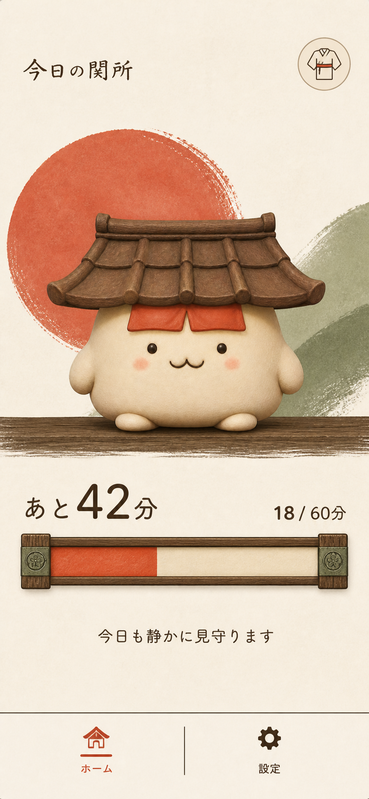
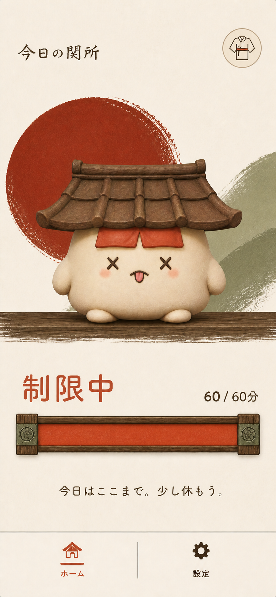
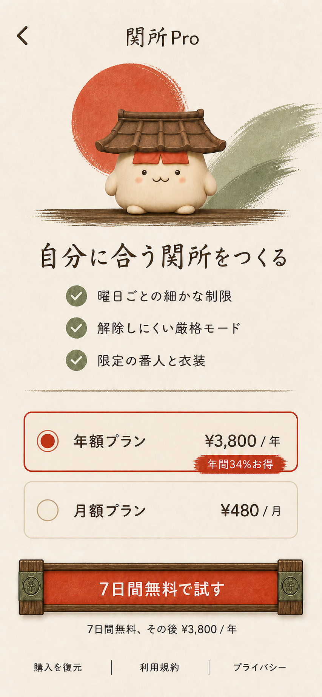
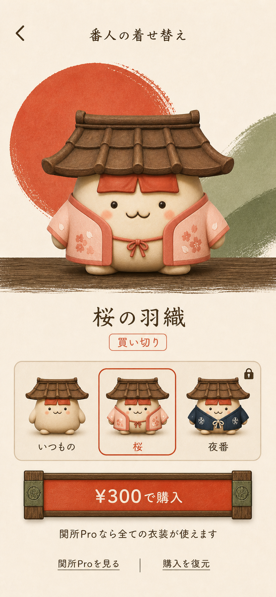

# Shipaton 2026 design direction

## Product promise

関所は、スマートフォンの利用制限を「罰」ではなく、3Dの番人と一緒に守る静かな約束として体験させる。MVPは個人利用に限定し、友達・グループ・罰金機能は含めない。

## Award strategy

- **Design Award**: 3D番人、和紙、朱の円、緑の筆跡、木製の時間バーを一貫した視覚言語にする。
- **Peace Award**: 制限到達時に罪悪感を煽らず、解除や課金を提示しない。
- **HAMM Award**: 制限解除ではなく、継続的に価値がある詳細設定と自己表現に課金する。

## Screen set

### Home / normal



- 3D番人を主役にし、その直下に残り時間と常時表示の時間バーを置く。
- ナビゲーションは「ホーム」「設定」の2タブだけにする。
- 右上の着物アイコンから着せ替えへ進む。
- ホームには許可、開始、停止、解除、購入のボタンを置かない。

### Home / limited



- 番人をX目の表情へ切り替え、残り時間を「制限中」へ変更する。
- 木製バーを朱色で100%満たし、文字と表情でも状態を伝える。
- コピーは「今日はここまで。少し休もう。」とし、解除・延長・課金を提示しない。
- 色だけに依存せず、VoiceOverでは「対象アプリを制限中」と読み上げる。

### Sekisho Pro



- 設定画面からユーザーの意思で開く。制限到達時には自動表示しない。
- Proの価値は「曜日ごとの細かな制限」「解除しにくい厳格モード」「限定の番人と衣装」。
- 年額を初期選択にしつつ、月額も同じ画面で選択できる。
- 購入復元、利用規約、プライバシーへの導線を常時表示する。
- 表示価格はモック。実装ではRevenueCatの `StoreProduct` からローカライズ済み価格を取得する。

暫定価格は月額480円、年額3,800円、7日間無料。年額は月額12か月分に対して約34%割引となる。価格と無料期間はApp Store Connect登録前に確定する。

### Mascot wardrobe



- 無料の標準衣装と、有料の買い切り衣装を同じ番人のバリエーションとして見せる。
- 選択中の衣装を大きな3Dプレビューで確認してから購入する。
- 単品購入は非消耗型IAPとし、購入済み衣装はPro解約後も保持する。
- Pro加入中はPro対象衣装を利用可能にする。購入復元も同じ画面に置く。

暫定の単品価格は300円。最初の有料衣装は「桜の羽織」とし、MVPでは衣装数を増やしすぎない。

### Settings

- 設定項目は「見守る対象」と「1日の上限」をまとめた「今日の約束」カードへ集約する。
- Screen Timeの許可と対象選択がそろった時点で、自動的に見守りを開始する。
- 通常の設定画面には停止・解除・手動開始を置かず、見守り中は対象を0件に戻せないようにする。
- 関所Proの導線では汎用的なキラキラ記号を使わず、桜衣装の番人をブランドアイコンとして表示する。

## Navigation and commerce flow

```text
ホーム（通常） ── 着物アイコン ── 着せ替え ── 衣装の単品購入
      │                                  └── 関所Proを見る
      └── 利用上限到達 ── ホーム（制限中）

設定 ── 関所Pro ── 月額または年額を購入
```

## RevenueCat model

- Entitlement: `premium`
- Subscription products: monthly and annual packages in the default offering
- One-time product: `mascot_sakura`
- Restore purchases: Pro画面と着せ替え画面の両方から実行可能
- 制限解除アイテムはMVPに含めない

### Implementation configuration

The iOS client uses RevenueCat through Swift Package Manager (`5.43.0` or later) and reads the public SDK key from the `REVENUECAT_API_KEY` build setting. The app continues to launch with an empty key so the visual prototype can be reviewed without store access.

Before purchase testing, configure the following in RevenueCat and set a public Test Store or App Store SDK key locally:

- Default offering: annual and monthly subscription packages
- Entitlement: `premium`
- Offering: `mascots`
- Non-consumable product and entitlement: `mascot_sakura`
- Annual product: 7-day free trial, then the finalized annual price

The terms-of-use and privacy-policy buttons are present in the Pro screen, but their production URLs still need to be supplied before release.

## Motion and accessibility

- 通常時の番人は、呼吸、数ポイントの上下移動、浅い横回転、接地影の伸縮を組み合わせて静かに待機する。
- 番人をタップすると、小さく弾むリアクションと軽い触覚フィードバックを返す。
- 制限中は振幅と速度を抑え、元気に跳ねて見えない落ち着いた動きへ切り替える。
- 通常から制限中への変化は、番人の短い表情クロスフェードとバーの充填で表す。
- `Reduce Motion` が有効な場合は、拡大・揺れ・バウンスを使わず即時切り替えにする。
- 実装上の文字は画像へ焼き込まずSwiftUIの `Text` を使い、Dynamic TypeとVoiceOverに対応する。
- 朱色と緑色だけで状態を判別させず、文言、表情、アクセシビリティラベルを併用する。

## Image-generation brief

Built-in image generation was used with the selected home concept and the existing normal/limited mascot assets as references. The final prompt set specified: a calm non-commercial limit state; a transparent RevenueCat subscription offer for advanced controls and outfits; and a one-time-purchase wardrobe that preserves mascot identity. All screens were constrained to the same washi, vermilion, sage, ink, and wood design system.
